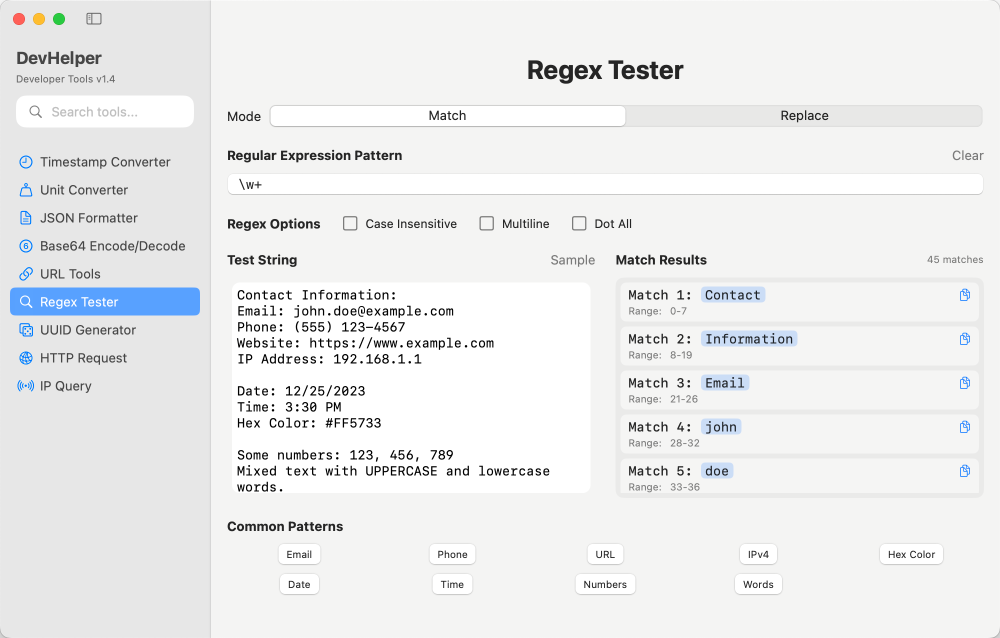

# DevHelper

A native macOS application for developers, containing essential tools commonly used in software development.

> This tool was 100% developed by `Claude Code`.

## Features

- **Timestamp Converter** - Convert between timestamps and human-readable dates with multiple format support
- **Unit Converter** - Convert between different units (Data, Length, Weight, Temperature, Area, Volume)
- **JSON Formatter** - Format and validate JSON data
- **Base64 Encode/Decode** - Encode and decode Base64 strings
- **Regex Tester** - Test regular expressions with pattern matching
- **UUID Generator** - Generate UUIDs in various formats
- **URL Tools** - URL encoding/decoding and parsing
- **HTTP Request** - Full-featured HTTP client with method selection, headers, auth, and response handling
- **IP Query** - Discover your IP address and query geolocation data for any IP

## Key Features

- **Search Functionality** - Quickly find tools using the search bar in the sidebar
- **Selectable Results** - Copy results directly from the output areas
- **Modern UI** - Clean, intuitive interface designed for macOS
- **Real-time Conversion** - Instant results as you type

## Requirements

- macOS 14.0 or later
- Xcode 15.4 or later (for development)

## Installation

1. Clone this repository
2. Open `DevHelper.xcodeproj` in Xcode
3. Build and run the project

## Version

Current version: 1.4 (Build 5)

## Screenshots

